```python
import pandas as pd
```

## 1) 데이터 불러오기


```python
train=pd.read_csv("train.csv")
test=pd.read_csv("test.csv")
```


```python
train.columns
```


    Index(['PassengerId', 'Survived', 'Pclass', 'Name', 'Sex', 'Age', 'SibSp',
           'Parch', 'Ticket', 'Fare', 'Cabin', 'Embarked'],
          dtype='object')


- survived : 생존 여부 (1: 생존 , 0: 사망)
- Pclass: 티켓 class (1:1등석 , 2:2등석, 3:3등석)
- SibSp : 함께 탑승한 형제 또는 배우자 수
- parch: 함께 탑승한 부모 또는 자녀의 수
- ticket: 티켓 수
- Cabin: 선실번호
- Embarked: 어느 선착장에서 탔는지 (C:cherbourg, Q:Queenstown, S:Southampton


```python
train.head()
```


<div>
<style scoped>
    .dataframe tbody tr th:only-of-type {
        vertical-align: middle;
    }

    .dataframe tbody tr th {
        vertical-align: top;
    }

    .dataframe thead th {
        text-align: right;
    }
</style>
<table border="1" class="dataframe">
  <thead>
    <tr style="text-align: right;">
      <th></th>
      <th>PassengerId</th>
      <th>Survived</th>
      <th>Pclass</th>
      <th>Name</th>
      <th>Sex</th>
      <th>Age</th>
      <th>SibSp</th>
      <th>Parch</th>
      <th>Ticket</th>
      <th>Fare</th>
      <th>Cabin</th>
      <th>Embarked</th>
    </tr>
  </thead>
  <tbody>
    <tr>
      <th>0</th>
      <td>1</td>
      <td>0</td>
      <td>3</td>
      <td>Braund, Mr. Owen Harris</td>
      <td>male</td>
      <td>22.0</td>
      <td>1</td>
      <td>0</td>
      <td>A/5 21171</td>
      <td>7.2500</td>
      <td>NaN</td>
      <td>S</td>
    </tr>
    <tr>
      <th>1</th>
      <td>2</td>
      <td>1</td>
      <td>1</td>
      <td>Cumings, Mrs. John Bradley (Florence Briggs Th...</td>
      <td>female</td>
      <td>38.0</td>
      <td>1</td>
      <td>0</td>
      <td>PC 17599</td>
      <td>71.2833</td>
      <td>C85</td>
      <td>C</td>
    </tr>
    <tr>
      <th>2</th>
      <td>3</td>
      <td>1</td>
      <td>3</td>
      <td>Heikkinen, Miss. Laina</td>
      <td>female</td>
      <td>26.0</td>
      <td>0</td>
      <td>0</td>
      <td>STON/O2. 3101282</td>
      <td>7.9250</td>
      <td>NaN</td>
      <td>S</td>
    </tr>
    <tr>
      <th>3</th>
      <td>4</td>
      <td>1</td>
      <td>1</td>
      <td>Futrelle, Mrs. Jacques Heath (Lily May Peel)</td>
      <td>female</td>
      <td>35.0</td>
      <td>1</td>
      <td>0</td>
      <td>113803</td>
      <td>53.1000</td>
      <td>C123</td>
      <td>S</td>
    </tr>
    <tr>
      <th>4</th>
      <td>5</td>
      <td>0</td>
      <td>3</td>
      <td>Allen, Mr. William Henry</td>
      <td>male</td>
      <td>35.0</td>
      <td>0</td>
      <td>0</td>
      <td>373450</td>
      <td>8.0500</td>
      <td>NaN</td>
      <td>S</td>
    </tr>
  </tbody>
</table>
</div>


```python
test.head()
```


<div>
<style scoped>
    .dataframe tbody tr th:only-of-type {
        vertical-align: middle;
    }

    .dataframe tbody tr th {
        vertical-align: top;
    }

    .dataframe thead th {
        text-align: right;
    }
</style>
<table border="1" class="dataframe">
  <thead>
    <tr style="text-align: right;">
      <th></th>
      <th>PassengerId</th>
      <th>Pclass</th>
      <th>Name</th>
      <th>Sex</th>
      <th>Age</th>
      <th>SibSp</th>
      <th>Parch</th>
      <th>Ticket</th>
      <th>Fare</th>
      <th>Cabin</th>
      <th>Embarked</th>
    </tr>
  </thead>
  <tbody>
    <tr>
      <th>0</th>
      <td>892</td>
      <td>3</td>
      <td>Kelly, Mr. James</td>
      <td>male</td>
      <td>34.5</td>
      <td>0</td>
      <td>0</td>
      <td>330911</td>
      <td>7.8292</td>
      <td>NaN</td>
      <td>Q</td>
    </tr>
    <tr>
      <th>1</th>
      <td>893</td>
      <td>3</td>
      <td>Wilkes, Mrs. James (Ellen Needs)</td>
      <td>female</td>
      <td>47.0</td>
      <td>1</td>
      <td>0</td>
      <td>363272</td>
      <td>7.0000</td>
      <td>NaN</td>
      <td>S</td>
    </tr>
    <tr>
      <th>2</th>
      <td>894</td>
      <td>2</td>
      <td>Myles, Mr. Thomas Francis</td>
      <td>male</td>
      <td>62.0</td>
      <td>0</td>
      <td>0</td>
      <td>240276</td>
      <td>9.6875</td>
      <td>NaN</td>
      <td>Q</td>
    </tr>
    <tr>
      <th>3</th>
      <td>895</td>
      <td>3</td>
      <td>Wirz, Mr. Albert</td>
      <td>male</td>
      <td>27.0</td>
      <td>0</td>
      <td>0</td>
      <td>315154</td>
      <td>8.6625</td>
      <td>NaN</td>
      <td>S</td>
    </tr>
    <tr>
      <th>4</th>
      <td>896</td>
      <td>3</td>
      <td>Hirvonen, Mrs. Alexander (Helga E Lindqvist)</td>
      <td>female</td>
      <td>22.0</td>
      <td>1</td>
      <td>1</td>
      <td>3101298</td>
      <td>12.2875</td>
      <td>NaN</td>
      <td>S</td>
    </tr>
  </tbody>
</table>
</div>


#### test: survived 컬럼 없음 -> 맞춰야 하므로


```python
print(train.shape,test.shape)
```

    (891, 12) (418, 11)
    

### 정보가 없는 경우 있어서 약간의 조정이 필요


```python
train.info()
```

    <class 'pandas.core.frame.DataFrame'>
    RangeIndex: 891 entries, 0 to 890
    Data columns (total 12 columns):
    PassengerId    891 non-null int64
    Survived       891 non-null int64
    Pclass         891 non-null int64
    Name           891 non-null object
    Sex            891 non-null object
    Age            714 non-null float64
    SibSp          891 non-null int64
    Parch          891 non-null int64
    Ticket         891 non-null object
    Fare           891 non-null float64
    Cabin          204 non-null object
    Embarked       889 non-null object
    dtypes: float64(2), int64(5), object(5)
    memory usage: 83.6+ KB
    


```python
test.info()
```

    <class 'pandas.core.frame.DataFrame'>
    RangeIndex: 418 entries, 0 to 417
    Data columns (total 11 columns):
    PassengerId    418 non-null int64
    Pclass         418 non-null int64
    Name           418 non-null object
    Sex            418 non-null object
    Age            332 non-null float64
    SibSp          418 non-null int64
    Parch          418 non-null int64
    Ticket         418 non-null object
    Fare           417 non-null float64
    Cabin          91 non-null object
    Embarked       418 non-null object
    dtypes: float64(2), int64(4), object(5)
    memory usage: 36.0+ KB
    


```python
train.isnull().sum()
```


    PassengerId      0
    Survived         0
    Pclass           0
    Name             0
    Sex              0
    Age            177
    SibSp            0
    Parch            0
    Ticket           0
    Fare             0
    Cabin          687
    Embarked         2
    dtype: int64


Age, Cabin na값들이 보임


```python
test.isnull().sum()
```


    PassengerId      0
    Pclass           0
    Name             0
    Sex              0
    Age             86
    SibSp            0
    Parch            0
    Ticket           0
    Fare             1
    Cabin          327
    Embarked         0
    dtype: int64


# 2) 시각화


```python
import matplotlib.pyplot as plt
%matplotlib inline
import seaborn as sns
sns.set()

```


```python
def bar_chart(features):
    Survived=train[train['Survived']==1][features].value_counts()
    dead=train[train['Survived']==0][features].value_counts()
    df=pd.DataFrame([Survived,dead])
    df.index=["Survived","dead"]
    df.plot(kind='bar',stacked=True, figsize=(10,5))
```

- pclass : 낮은 등급일수록 사망할 경우가 많음


```python
bar_chart("Pclass")
```


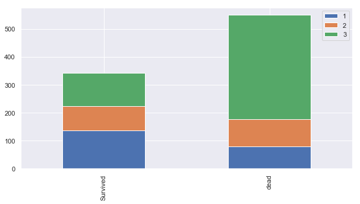


- Sex: 남성일 경우 사망할 경우 많음


```python
bar_chart('Sex')
```


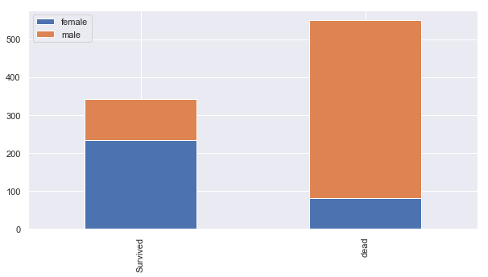


- 'Embarked': S일수록 사망


```python
bar_chart("Embarked")
```


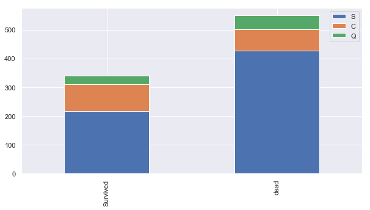


- SibSp: 동승한 형제나 배우자가 없을수록 사망 많음


```python
bar_chart("SibSp")
```


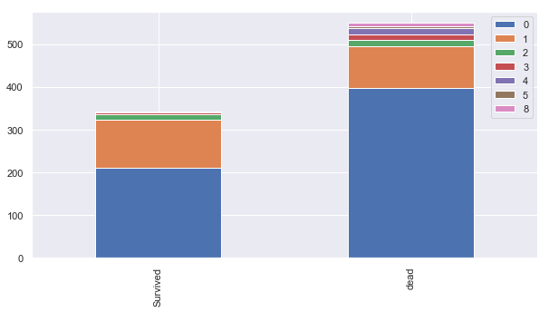


- Parch: 부모님이나 자녀가 동승할 경우 살 확률이 높음


```python
bar_chart("Parch")
```


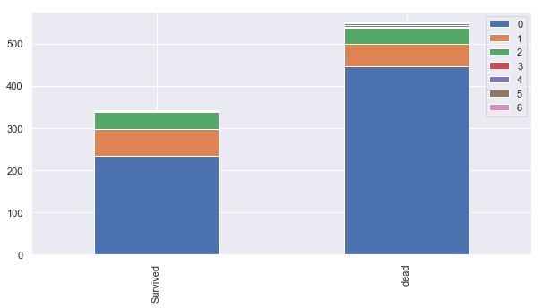


## 3) feature engineering


```python
train.head()
```


<div>
<style scoped>
    .dataframe tbody tr th:only-of-type {
        vertical-align: middle;
    }

    .dataframe tbody tr th {
        vertical-align: top;
    }

    .dataframe thead th {
        text-align: right;
    }
</style>
<table border="1" class="dataframe">
  <thead>
    <tr style="text-align: right;">
      <th></th>
      <th>PassengerId</th>
      <th>Survived</th>
      <th>Pclass</th>
      <th>Name</th>
      <th>Sex</th>
      <th>Age</th>
      <th>SibSp</th>
      <th>Parch</th>
      <th>Ticket</th>
      <th>Fare</th>
      <th>Cabin</th>
      <th>Embarked</th>
    </tr>
  </thead>
  <tbody>
    <tr>
      <th>0</th>
      <td>1</td>
      <td>0</td>
      <td>3</td>
      <td>Braund, Mr. Owen Harris</td>
      <td>male</td>
      <td>22.0</td>
      <td>1</td>
      <td>0</td>
      <td>A/5 21171</td>
      <td>7.2500</td>
      <td>NaN</td>
      <td>S</td>
    </tr>
    <tr>
      <th>1</th>
      <td>2</td>
      <td>1</td>
      <td>1</td>
      <td>Cumings, Mrs. John Bradley (Florence Briggs Th...</td>
      <td>female</td>
      <td>38.0</td>
      <td>1</td>
      <td>0</td>
      <td>PC 17599</td>
      <td>71.2833</td>
      <td>C85</td>
      <td>C</td>
    </tr>
    <tr>
      <th>2</th>
      <td>3</td>
      <td>1</td>
      <td>3</td>
      <td>Heikkinen, Miss. Laina</td>
      <td>female</td>
      <td>26.0</td>
      <td>0</td>
      <td>0</td>
      <td>STON/O2. 3101282</td>
      <td>7.9250</td>
      <td>NaN</td>
      <td>S</td>
    </tr>
    <tr>
      <th>3</th>
      <td>4</td>
      <td>1</td>
      <td>1</td>
      <td>Futrelle, Mrs. Jacques Heath (Lily May Peel)</td>
      <td>female</td>
      <td>35.0</td>
      <td>1</td>
      <td>0</td>
      <td>113803</td>
      <td>53.1000</td>
      <td>C123</td>
      <td>S</td>
    </tr>
    <tr>
      <th>4</th>
      <td>5</td>
      <td>0</td>
      <td>3</td>
      <td>Allen, Mr. William Henry</td>
      <td>male</td>
      <td>35.0</td>
      <td>0</td>
      <td>0</td>
      <td>373450</td>
      <td>8.0500</td>
      <td>NaN</td>
      <td>S</td>
    </tr>
  </tbody>
</table>
</div>


- Name : 타이틀을 가져오기


```python
train_test_data=[train,test]
for data in train_test_data:
    data['title']=data["Name"].str.extract(' ([A-Za-z]+)\.',expand= False)
    #공백이 포함후, 끝에 특수포함되고 알파벳(대문자 소문자)가 1개이상을 포함하는 하나의 문자(단어)
```


```python
train['title'].value_counts()
```


    Mr          517
    Miss        182
    Mrs         125
    Master       40
    Dr            7
    Rev           6
    Col           2
    Mlle          2
    Major         2
    Jonkheer      1
    Countess      1
    Lady          1
    Don           1
    Ms            1
    Mme           1
    Sir           1
    Capt          1
    Name: title, dtype: int64


```python
test['title'].value_counts()
```


    Mr        240
    Miss       78
    Mrs        72
    Master     21
    Rev         2
    Col         2
    Ms          1
    Dr          1
    Dona        1
    Name: title, dtype: int64


```python
mapping={'Mr':0,'Miss':1,'Mrs': 2,'Master': 3, 'Dr': 3, 'Rev': 3, 'Col':3,
         'Major':3, 'Mlle':3,'Sir':3 ,'Don':3,'Jonkheer':3,'Capt':3,'Ms':3,'Countess':3,'Mme':3, 'Lady':3,'Dona':1 }
for data in train_test_data:
    data['title']=data['title'].map(mapping)
```


```python
train.head()
```


<div>
<style scoped>
    .dataframe tbody tr th:only-of-type {
        vertical-align: middle;
    }

    .dataframe tbody tr th {
        vertical-align: top;
    }

    .dataframe thead th {
        text-align: right;
    }
</style>
<table border="1" class="dataframe">
  <thead>
    <tr style="text-align: right;">
      <th></th>
      <th>PassengerId</th>
      <th>Survived</th>
      <th>Pclass</th>
      <th>Name</th>
      <th>Sex</th>
      <th>Age</th>
      <th>SibSp</th>
      <th>Parch</th>
      <th>Ticket</th>
      <th>Fare</th>
      <th>Cabin</th>
      <th>Embarked</th>
      <th>title</th>
    </tr>
  </thead>
  <tbody>
    <tr>
      <th>0</th>
      <td>1</td>
      <td>0</td>
      <td>3</td>
      <td>Braund, Mr. Owen Harris</td>
      <td>male</td>
      <td>22.0</td>
      <td>1</td>
      <td>0</td>
      <td>A/5 21171</td>
      <td>7.2500</td>
      <td>NaN</td>
      <td>S</td>
      <td>0</td>
    </tr>
    <tr>
      <th>1</th>
      <td>2</td>
      <td>1</td>
      <td>1</td>
      <td>Cumings, Mrs. John Bradley (Florence Briggs Th...</td>
      <td>female</td>
      <td>38.0</td>
      <td>1</td>
      <td>0</td>
      <td>PC 17599</td>
      <td>71.2833</td>
      <td>C85</td>
      <td>C</td>
      <td>2</td>
    </tr>
    <tr>
      <th>2</th>
      <td>3</td>
      <td>1</td>
      <td>3</td>
      <td>Heikkinen, Miss. Laina</td>
      <td>female</td>
      <td>26.0</td>
      <td>0</td>
      <td>0</td>
      <td>STON/O2. 3101282</td>
      <td>7.9250</td>
      <td>NaN</td>
      <td>S</td>
      <td>1</td>
    </tr>
    <tr>
      <th>3</th>
      <td>4</td>
      <td>1</td>
      <td>1</td>
      <td>Futrelle, Mrs. Jacques Heath (Lily May Peel)</td>
      <td>female</td>
      <td>35.0</td>
      <td>1</td>
      <td>0</td>
      <td>113803</td>
      <td>53.1000</td>
      <td>C123</td>
      <td>S</td>
      <td>2</td>
    </tr>
    <tr>
      <th>4</th>
      <td>5</td>
      <td>0</td>
      <td>3</td>
      <td>Allen, Mr. William Henry</td>
      <td>male</td>
      <td>35.0</td>
      <td>0</td>
      <td>0</td>
      <td>373450</td>
      <td>8.0500</td>
      <td>NaN</td>
      <td>S</td>
      <td>0</td>
    </tr>
  </tbody>
</table>
</div>


```python
bar_chart('title')
```


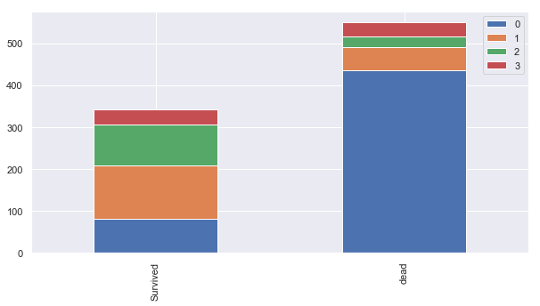


Mr(남자)=0, Mrs, Mis(여자)=1  

여자가 많이 살았다.

- sex 


```python
sex_map={"male":0,"female":1}
for data in train_test_data:
    data['Sex']=data['Sex'].map(sex_map)
```


```python
train.head()
```


<div>
<style scoped>
    .dataframe tbody tr th:only-of-type {
        vertical-align: middle;
    }

    .dataframe tbody tr th {
        vertical-align: top;
    }

    .dataframe thead th {
        text-align: right;
    }
</style>
<table border="1" class="dataframe">
  <thead>
    <tr style="text-align: right;">
      <th></th>
      <th>PassengerId</th>
      <th>Survived</th>
      <th>Pclass</th>
      <th>Name</th>
      <th>Sex</th>
      <th>Age</th>
      <th>SibSp</th>
      <th>Parch</th>
      <th>Ticket</th>
      <th>Fare</th>
      <th>Cabin</th>
      <th>Embarked</th>
      <th>title</th>
    </tr>
  </thead>
  <tbody>
    <tr>
      <th>0</th>
      <td>1</td>
      <td>0</td>
      <td>3</td>
      <td>Braund, Mr. Owen Harris</td>
      <td>0</td>
      <td>22.0</td>
      <td>1</td>
      <td>0</td>
      <td>A/5 21171</td>
      <td>7.2500</td>
      <td>NaN</td>
      <td>S</td>
      <td>0</td>
    </tr>
    <tr>
      <th>1</th>
      <td>2</td>
      <td>1</td>
      <td>1</td>
      <td>Cumings, Mrs. John Bradley (Florence Briggs Th...</td>
      <td>1</td>
      <td>38.0</td>
      <td>1</td>
      <td>0</td>
      <td>PC 17599</td>
      <td>71.2833</td>
      <td>C85</td>
      <td>C</td>
      <td>2</td>
    </tr>
    <tr>
      <th>2</th>
      <td>3</td>
      <td>1</td>
      <td>3</td>
      <td>Heikkinen, Miss. Laina</td>
      <td>1</td>
      <td>26.0</td>
      <td>0</td>
      <td>0</td>
      <td>STON/O2. 3101282</td>
      <td>7.9250</td>
      <td>NaN</td>
      <td>S</td>
      <td>1</td>
    </tr>
    <tr>
      <th>3</th>
      <td>4</td>
      <td>1</td>
      <td>1</td>
      <td>Futrelle, Mrs. Jacques Heath (Lily May Peel)</td>
      <td>1</td>
      <td>35.0</td>
      <td>1</td>
      <td>0</td>
      <td>113803</td>
      <td>53.1000</td>
      <td>C123</td>
      <td>S</td>
      <td>2</td>
    </tr>
    <tr>
      <th>4</th>
      <td>5</td>
      <td>0</td>
      <td>3</td>
      <td>Allen, Mr. William Henry</td>
      <td>0</td>
      <td>35.0</td>
      <td>0</td>
      <td>0</td>
      <td>373450</td>
      <td>8.0500</td>
      <td>NaN</td>
      <td>S</td>
      <td>0</td>
    </tr>
  </tbody>
</table>
</div>


```python
bar_chart('Sex')
```


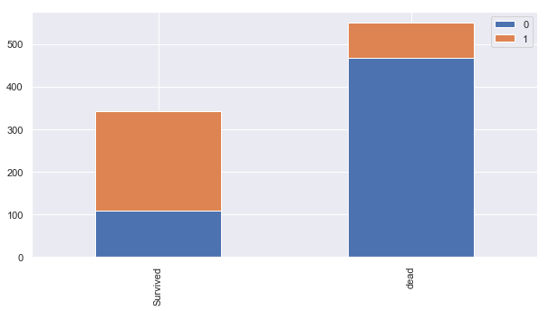


남자가 많이 사망한 것을 알 수 있음

- Age 


```python
train["Age"][:100]
```


    0     22.00
    1     38.00
    2     26.00
    3     35.00
    4     35.00
    5       NaN
    6     54.00
    7      2.00
    8     27.00
    9     14.00
    10     4.00
    11    58.00
    12    20.00
    13    39.00
    14    14.00
    15    55.00
    16     2.00
    17      NaN
    18    31.00
    19      NaN
    20    35.00
    21    34.00
    22    15.00
    23    28.00
    24     8.00
    25    38.00
    26      NaN
    27    19.00
    28      NaN
    29      NaN
          ...  
    70    32.00
    71    16.00
    72    21.00
    73    26.00
    74    32.00
    75    25.00
    76      NaN
    77      NaN
    78     0.83
    79    30.00
    80    22.00
    81    29.00
    82      NaN
    83    28.00
    84    17.00
    85    33.00
    86    16.00
    87      NaN
    88    23.00
    89    24.00
    90    29.00
    91    20.00
    92    46.00
    93    26.00
    94    59.00
    95      NaN
    96    71.00
    97    23.00
    98    34.00
    99    34.00
    Name: Age, Length: 100, dtype: float64


```python
#nan을 다른 수로 채우기
train["Age"].fillna(train.groupby("title")["Age"].transform("mean"),inplace=True) 
#transform() 인자: 스칼라 값이나 같은 크기를 가지는 배열을 반환하는 함수
test["Age"].fillna(test.groupby("title")["Age"].transform("mean"),inplace=True) 
```


```python
train["Age"].plot.hist(bins=30)
```


    <matplotlib.axes._subplots.AxesSubplot at 0x21e382e7080>


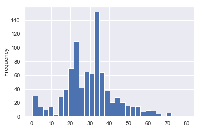


```python
age_survived=sns.FacetGrid(train, hue='Survived',aspect=4)
age_survived.map(sns.kdeplot,'Age',shade=True)
age_survived.add_legend()
plt.show()
```


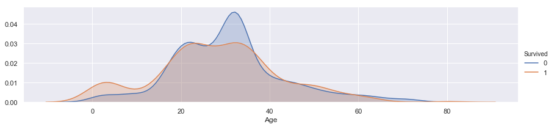


```python
age_survived=sns.FacetGrid(train, hue='Survived',aspect=4)
age_survived.map(sns.kdeplot,'Age',shade=True)
age_survived.add_legend()
plt.xlim(20,40)
```


    (20, 40)


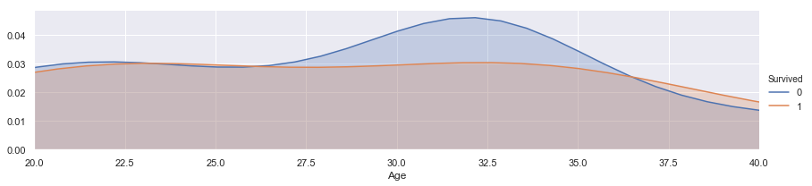


##### 나누는 기준
- 어린이(0~13):0
- 학생(14~20): 1
- 청년(21~35):2
- 어른(36~60):3
- 노인(61~):4


```python
train_test_data=[train,test]
for data in train_test_data:
    data.loc[data['Age']<=13,'Age']=0,
    data.loc[(13<data['Age'])& (data['Age']<=20),'Age']=1,
    data.loc[(20<data['Age'])&(data['Age']<=35),'Age']=2,
    data.loc[(35<data['Age'])&(data['Age']<=60),'Age']=3,
    data.loc[data['Age']>60,'Age']=4
   
```


```python
train.head()
```


<div>
<style scoped>
    .dataframe tbody tr th:only-of-type {
        vertical-align: middle;
    }

    .dataframe tbody tr th {
        vertical-align: top;
    }

    .dataframe thead th {
        text-align: right;
    }
</style>
<table border="1" class="dataframe">
  <thead>
    <tr style="text-align: right;">
      <th></th>
      <th>PassengerId</th>
      <th>Survived</th>
      <th>Pclass</th>
      <th>Name</th>
      <th>Sex</th>
      <th>Age</th>
      <th>SibSp</th>
      <th>Parch</th>
      <th>Ticket</th>
      <th>Fare</th>
      <th>Cabin</th>
      <th>Embarked</th>
      <th>title</th>
    </tr>
  </thead>
  <tbody>
    <tr>
      <th>0</th>
      <td>1</td>
      <td>0</td>
      <td>3</td>
      <td>Braund, Mr. Owen Harris</td>
      <td>0</td>
      <td>2.0</td>
      <td>1</td>
      <td>0</td>
      <td>A/5 21171</td>
      <td>7.2500</td>
      <td>NaN</td>
      <td>S</td>
      <td>0</td>
    </tr>
    <tr>
      <th>1</th>
      <td>2</td>
      <td>1</td>
      <td>1</td>
      <td>Cumings, Mrs. John Bradley (Florence Briggs Th...</td>
      <td>1</td>
      <td>3.0</td>
      <td>1</td>
      <td>0</td>
      <td>PC 17599</td>
      <td>71.2833</td>
      <td>C85</td>
      <td>C</td>
      <td>2</td>
    </tr>
    <tr>
      <th>2</th>
      <td>3</td>
      <td>1</td>
      <td>3</td>
      <td>Heikkinen, Miss. Laina</td>
      <td>1</td>
      <td>2.0</td>
      <td>0</td>
      <td>0</td>
      <td>STON/O2. 3101282</td>
      <td>7.9250</td>
      <td>NaN</td>
      <td>S</td>
      <td>1</td>
    </tr>
    <tr>
      <th>3</th>
      <td>4</td>
      <td>1</td>
      <td>1</td>
      <td>Futrelle, Mrs. Jacques Heath (Lily May Peel)</td>
      <td>1</td>
      <td>2.0</td>
      <td>1</td>
      <td>0</td>
      <td>113803</td>
      <td>53.1000</td>
      <td>C123</td>
      <td>S</td>
      <td>2</td>
    </tr>
    <tr>
      <th>4</th>
      <td>5</td>
      <td>0</td>
      <td>3</td>
      <td>Allen, Mr. William Henry</td>
      <td>0</td>
      <td>2.0</td>
      <td>0</td>
      <td>0</td>
      <td>373450</td>
      <td>8.0500</td>
      <td>NaN</td>
      <td>S</td>
      <td>0</td>
    </tr>
  </tbody>
</table>
</div>


```python
bar_chart('Age')
```


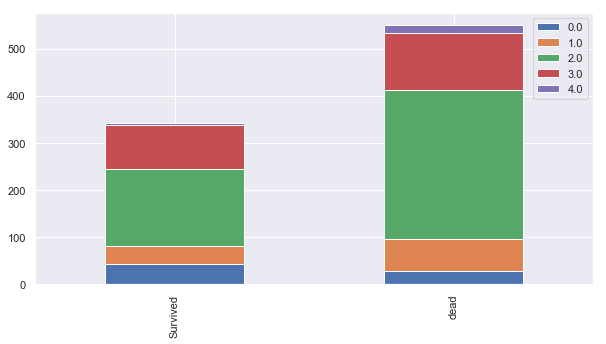


21~35세 청년의 사망이 큼. 61세이상 노인의 대부분도 사망


```python
pclass1= train[train['Pclass']==1]['Embarked'].value_counts()
pclass2= train[train['Pclass']==2]['Embarked'].value_counts()
pclass3= train[train['Pclass']==3]['Embarked'].value_counts()
df=pd.DataFrame([pclass1,pclass2,pclass3])
df.index=["1st class",'2nd clss','3rd class']
df.plot(kind='bar',stacked=True, figsize=(10,5))
```


    <matplotlib.axes._subplots.AxesSubplot at 0x21e381d99b0>


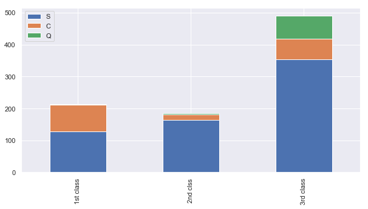


3rd의 비중이 s가 큼


```python
for data in train_test_data:
    data["Embarked"]=data['Embarked'].fillna('S')
```


```python
train[["Pclass","Embarked"]].groupby("Embarked").count()
```


<div>
<style scoped>
    .dataframe tbody tr th:only-of-type {
        vertical-align: middle;
    }

    .dataframe tbody tr th {
        vertical-align: top;
    }

    .dataframe thead th {
        text-align: right;
    }
</style>
<table border="1" class="dataframe">
  <thead>
    <tr style="text-align: right;">
      <th></th>
      <th>Pclass</th>
    </tr>
    <tr>
      <th>Embarked</th>
      <th></th>
    </tr>
  </thead>
  <tbody>
    <tr>
      <th>C</th>
      <td>168</td>
    </tr>
    <tr>
      <th>Q</th>
      <td>77</td>
    </tr>
    <tr>
      <th>S</th>
      <td>646</td>
    </tr>
  </tbody>
</table>
</div>


```python
embarked_map={"C":0,"Q":1,"S":2}
for data in train_test_data:
    data["Embarked"]=data["Embarked"].map(embarked_map)
```


```python
train["Embarked"][:10]
```


    0    2
    1    0
    2    2
    3    2
    4    2
    5    1
    6    2
    7    2
    8    2
    9    0
    Name: Embarked, dtype: int64


- Fare


```python
#nan을 다른 수로 채우기
train["Fare"].fillna(train.groupby("Pclass")["Fare"].transform("mean"),inplace=True) 
#transform() 인자: 스칼라 값이나 같은 크기를 가지는 배열을 반환하는 함수
test["Fare"].fillna(test.groupby("Pclass")["Fare"].transform("mean"),inplace=True) 
```


```python
fare_survived=sns.FacetGrid(train, hue='Survived',aspect=4)
fare_survived.map(sns.kdeplot,'Fare',shade=True)
fare_survived.add_legend()
plt.show()
```


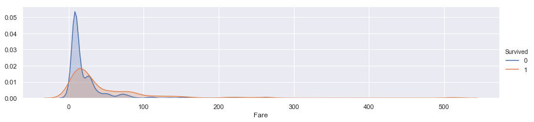


```python
for data in train_test_data:
    data.loc[data['Fare']<=15,'Fare']=0,
    data.loc[(15<data['Fare'])& (data['Fare']<=30),'Fare']=1,
    data.loc[(30<data['Fare'])&(data['Fare']<=100),'Fare']=2,
    data.loc[data['Fare']>100,'Fare']=3
```


```python
train.head()
```


<div>
<style scoped>
    .dataframe tbody tr th:only-of-type {
        vertical-align: middle;
    }

    .dataframe tbody tr th {
        vertical-align: top;
    }

    .dataframe thead th {
        text-align: right;
    }
</style>
<table border="1" class="dataframe">
  <thead>
    <tr style="text-align: right;">
      <th></th>
      <th>PassengerId</th>
      <th>Survived</th>
      <th>Pclass</th>
      <th>Name</th>
      <th>Sex</th>
      <th>Age</th>
      <th>SibSp</th>
      <th>Parch</th>
      <th>Ticket</th>
      <th>Fare</th>
      <th>Cabin</th>
      <th>Embarked</th>
      <th>title</th>
    </tr>
  </thead>
  <tbody>
    <tr>
      <th>0</th>
      <td>1</td>
      <td>0</td>
      <td>3</td>
      <td>Braund, Mr. Owen Harris</td>
      <td>0</td>
      <td>2.0</td>
      <td>1</td>
      <td>0</td>
      <td>A/5 21171</td>
      <td>0.0</td>
      <td>NaN</td>
      <td>2</td>
      <td>0</td>
    </tr>
    <tr>
      <th>1</th>
      <td>2</td>
      <td>1</td>
      <td>1</td>
      <td>Cumings, Mrs. John Bradley (Florence Briggs Th...</td>
      <td>1</td>
      <td>3.0</td>
      <td>1</td>
      <td>0</td>
      <td>PC 17599</td>
      <td>2.0</td>
      <td>C85</td>
      <td>0</td>
      <td>2</td>
    </tr>
    <tr>
      <th>2</th>
      <td>3</td>
      <td>1</td>
      <td>3</td>
      <td>Heikkinen, Miss. Laina</td>
      <td>1</td>
      <td>2.0</td>
      <td>0</td>
      <td>0</td>
      <td>STON/O2. 3101282</td>
      <td>0.0</td>
      <td>NaN</td>
      <td>2</td>
      <td>1</td>
    </tr>
    <tr>
      <th>3</th>
      <td>4</td>
      <td>1</td>
      <td>1</td>
      <td>Futrelle, Mrs. Jacques Heath (Lily May Peel)</td>
      <td>1</td>
      <td>2.0</td>
      <td>1</td>
      <td>0</td>
      <td>113803</td>
      <td>2.0</td>
      <td>C123</td>
      <td>2</td>
      <td>2</td>
    </tr>
    <tr>
      <th>4</th>
      <td>5</td>
      <td>0</td>
      <td>3</td>
      <td>Allen, Mr. William Henry</td>
      <td>0</td>
      <td>2.0</td>
      <td>0</td>
      <td>0</td>
      <td>373450</td>
      <td>0.0</td>
      <td>NaN</td>
      <td>2</td>
      <td>0</td>
    </tr>
  </tbody>
</table>
</div>


- cabin


```python
train.Cabin.value_counts()
```


    G6                 4
    B96 B98            4
    C23 C25 C27        4
    F2                 3
    D                  3
    E101               3
    F33                3
    C22 C26            3
    B35                2
    B5                 2
    D36                2
    B77                2
    E24                2
    C68                2
    F4                 2
    C93                2
    C124               2
    C2                 2
    D35                2
    B57 B59 B63 B66    2
    B49                2
    B18                2
    E121               2
    E33                2
    B58 B60            2
    C65                2
    E67                2
    E25                2
    B28                2
    B51 B53 B55        2
                      ..
    C82                1
    D7                 1
    D47                1
    E36                1
    A19                1
    B80                1
    E68                1
    B38                1
    E17                1
    A5                 1
    E12                1
    C118               1
    B30                1
    C103               1
    A7                 1
    D28                1
    D45                1
    D30                1
    D56                1
    D48                1
    D50                1
    C30                1
    B41                1
    C110               1
    B86                1
    C70                1
    A23                1
    B101               1
    F38                1
    B42                1
    Name: Cabin, Length: 147, dtype: int64


```python
for data in train_test_data:
    data['Cabin']=data['Cabin'].str[:1]
```


```python
pclass1= train[train['Pclass']==1]['Cabin'].value_counts()
pclass2= train[train['Pclass']==2]['Cabin'].value_counts()
pclass3= train[train['Pclass']==3]['Cabin'].value_counts()
df=pd.DataFrame([pclass1,pclass2,pclass3])
df.index=["1st class",'2nd clss','3rd class']
df.plot(kind='bar',stacked=True, figsize=(10,5))
```


    <matplotlib.axes._subplots.AxesSubplot at 0x21e354dcb70>


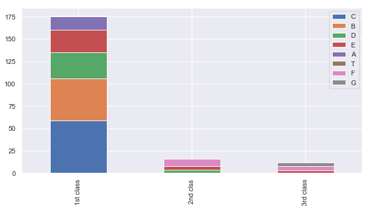


- a,b,c,d,e => 1등급
- d,e,f=>2등급
- e,f,g=> 3등급


```python
cabin_map={"A":0,"B":0.3,"C":0.6,"D":0.8,"E":1,"F":1.2,"G":1.4,"T":1.6}
for data in train_test_data:
    data['Cabin']=data['Cabin'].map(cabin_map)
```


```python
train['Cabin'].fillna(train.groupby("Pclass")["Cabin"].transform("mean"),inplace=True)
test['Cabin'].fillna(test.groupby("Pclass")["Cabin"].transform("mean"),inplace=True)
```

- family


```python
train["Family"]=train["SibSp"]+train["Parch"]+1
test["Family"]=test["SibSp"]+test["Parch"]+1
```


```python
family_survived=sns.FacetGrid(train, hue='Survived',aspect=4)
family_survived.map(sns.kdeplot,'Family',shade=True)
family_survived.set(xlim=(0,train['Family'].max()))
family_survived.add_legend()
plt.show()
```


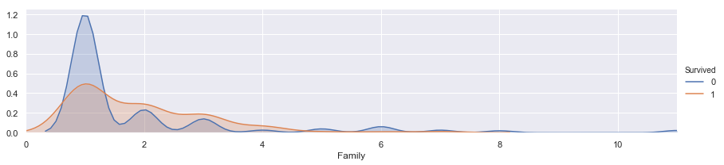


```python
train['Family'].isnull().sum()
```


    0


```python
family_map={1:0, 2:0.2, 3:0.6, 4:0.9, 5:1.2, 6:1.5, 7:1.8, 8:2.1, 9:2.4, 10:2.7, 11:3}
for data in train_test_data:
    data['Family']=data['Family'].map(family_map)
```


```python
train.head()
```


<div>
<style scoped>
    .dataframe tbody tr th:only-of-type {
        vertical-align: middle;
    }

    .dataframe tbody tr th {
        vertical-align: top;
    }

    .dataframe thead th {
        text-align: right;
    }
</style>
<table border="1" class="dataframe">
  <thead>
    <tr style="text-align: right;">
      <th></th>
      <th>PassengerId</th>
      <th>Survived</th>
      <th>Pclass</th>
      <th>Name</th>
      <th>Sex</th>
      <th>Age</th>
      <th>SibSp</th>
      <th>Parch</th>
      <th>Ticket</th>
      <th>Fare</th>
      <th>Cabin</th>
      <th>Embarked</th>
      <th>title</th>
      <th>Family</th>
    </tr>
  </thead>
  <tbody>
    <tr>
      <th>0</th>
      <td>1</td>
      <td>0</td>
      <td>3</td>
      <td>Braund, Mr. Owen Harris</td>
      <td>0</td>
      <td>2.0</td>
      <td>1</td>
      <td>0</td>
      <td>A/5 21171</td>
      <td>0.0</td>
      <td>1.216667</td>
      <td>2</td>
      <td>0</td>
      <td>0.2</td>
    </tr>
    <tr>
      <th>1</th>
      <td>2</td>
      <td>1</td>
      <td>1</td>
      <td>Cumings, Mrs. John Bradley (Florence Briggs Th...</td>
      <td>1</td>
      <td>3.0</td>
      <td>1</td>
      <td>0</td>
      <td>PC 17599</td>
      <td>2.0</td>
      <td>0.600000</td>
      <td>0</td>
      <td>2</td>
      <td>0.2</td>
    </tr>
    <tr>
      <th>2</th>
      <td>3</td>
      <td>1</td>
      <td>3</td>
      <td>Heikkinen, Miss. Laina</td>
      <td>1</td>
      <td>2.0</td>
      <td>0</td>
      <td>0</td>
      <td>STON/O2. 3101282</td>
      <td>0.0</td>
      <td>1.216667</td>
      <td>2</td>
      <td>1</td>
      <td>0.0</td>
    </tr>
    <tr>
      <th>3</th>
      <td>4</td>
      <td>1</td>
      <td>1</td>
      <td>Futrelle, Mrs. Jacques Heath (Lily May Peel)</td>
      <td>1</td>
      <td>2.0</td>
      <td>1</td>
      <td>0</td>
      <td>113803</td>
      <td>2.0</td>
      <td>0.600000</td>
      <td>2</td>
      <td>2</td>
      <td>0.2</td>
    </tr>
    <tr>
      <th>4</th>
      <td>5</td>
      <td>0</td>
      <td>3</td>
      <td>Allen, Mr. William Henry</td>
      <td>0</td>
      <td>2.0</td>
      <td>0</td>
      <td>0</td>
      <td>373450</td>
      <td>0.0</td>
      <td>1.216667</td>
      <td>2</td>
      <td>0</td>
      <td>0.0</td>
    </tr>
  </tbody>
</table>
</div>


```python
#na 확인
test[test["Family"].isnull()==True]
```


<div>
<style scoped>
    .dataframe tbody tr th:only-of-type {
        vertical-align: middle;
    }

    .dataframe tbody tr th {
        vertical-align: top;
    }

    .dataframe thead th {
        text-align: right;
    }
</style>
<table border="1" class="dataframe">
  <thead>
    <tr style="text-align: right;">
      <th></th>
      <th>PassengerId</th>
      <th>Pclass</th>
      <th>Name</th>
      <th>Sex</th>
      <th>Age</th>
      <th>SibSp</th>
      <th>Parch</th>
      <th>Ticket</th>
      <th>Fare</th>
      <th>Cabin</th>
      <th>Embarked</th>
      <th>title</th>
      <th>Family</th>
    </tr>
  </thead>
  <tbody>
  </tbody>
</table>
</div>


```python
train=train.drop(["Name","Ticket","Parch","SibSp"],axis=1)
test=test.drop(["Name","Ticket","Parch","SibSp"],axis=1)
```


```python
train_data=train.drop("Survived",axis=1)
target=train["Survived"]
```

## 4) 모델링


```python
from sklearn.neighbors import KNeighborsClassifier
from sklearn.tree import DecisionTreeClassifier
from sklearn.ensemble import RandomForestClassifier
from sklearn.naive_bayes import GaussianNB
from sklearn.svm import SVC
from sklearn.linear_model import LogisticRegression

import numpy as np
```


```python
train.info()
```

    <class 'pandas.core.frame.DataFrame'>
    RangeIndex: 891 entries, 0 to 890
    Data columns (total 10 columns):
    PassengerId    891 non-null int64
    Survived       891 non-null int64
    Pclass         891 non-null int64
    Sex            891 non-null int64
    Age            891 non-null float64
    Fare           891 non-null float64
    Cabin          891 non-null float64
    Embarked       891 non-null int64
    title          891 non-null int64
    Family         891 non-null float64
    dtypes: float64(4), int64(6)
    memory usage: 69.7 KB
    

### Cross Validation (k-fold)


```python
from sklearn.model_selection import KFold
from sklearn.model_selection import cross_val_score
k_fold=KFold(n_splits=8,shuffle=True,random_state=0)
```

### knn
데이터를 분류를 할 때 k개의 이웃 중 거리가 가까운 이웃의 영향을 더 많이 받도록 weight 지정 가능


```python
clf=KNeighborsClassifier(n_neighbors=12)
scoring="accuracy"
score=cross_val_score(clf, train_data, target, cv=k_fold, n_jobs=1, scoring=scoring)
#n_jobs는 사용할 코어의 갯수 입니다. -1이면 모든 코어를 사용
print(score)
```

    [0.52678571 0.61607143 0.58035714 0.63963964 0.56756757 0.53153153
     0.58558559 0.51351351]
    


```python
round(np.mean(score)*100,2)
```


    57.01


### Decision Tree


```python
clf=DecisionTreeClassifier()
score=cross_val_score(clf, train_data, target, cv=k_fold,n_jobs=1,scoring=scoring)
print(score)
```

    [0.75       0.75892857 0.79464286 0.71171171 0.76576577 0.78378378
     0.72972973 0.74774775]
    


```python
round(np.mean(score)*100,2)
```


    75.53


```python
clf=RandomForestClassifier(n_estimators=10)
scoring="accuracy"
score= cross_val_score(clf, train_data, target, cv=k_fold,n_jobs=1,scoring=scoring)
print(score)
```

    [0.83928571 0.83928571 0.82142857 0.8018018  0.8018018  0.8018018
     0.72972973 0.81081081]
    


```python
round(np.mean(score)*100,2)
```


    80.57


### Naive Bayes


```python
clf=GaussianNB()
scoring="accuracy"
score= cross_val_score(clf, train_data, target, cv=k_fold,n_jobs=1,scoring=scoring)
print(score)
```

    [0.83035714 0.74107143 0.75892857 0.73873874 0.79279279 0.77477477
     0.79279279 0.84684685]
    


```python
round(np.mean(score)*100,2)
```


    78.45


```python
clf=SVC()
scoring="accuracy"
score= cross_val_score(clf, train_data, target, cv=k_fold,n_jobs=1,scoring=scoring)
print(score)
```

    C:\ProgramData\Anaconda3\lib\site-packages\sklearn\svm\base.py:196: FutureWarning: The default value of gamma will change from 'auto' to 'scale' in version 0.22 to account better for unscaled features. Set gamma explicitly to 'auto' or 'scale' to avoid this warning.
      "avoid this warning.", FutureWarning)
    C:\ProgramData\Anaconda3\lib\site-packages\sklearn\svm\base.py:196: FutureWarning: The default value of gamma will change from 'auto' to 'scale' in version 0.22 to account better for unscaled features. Set gamma explicitly to 'auto' or 'scale' to avoid this warning.
      "avoid this warning.", FutureWarning)
    C:\ProgramData\Anaconda3\lib\site-packages\sklearn\svm\base.py:196: FutureWarning: The default value of gamma will change from 'auto' to 'scale' in version 0.22 to account better for unscaled features. Set gamma explicitly to 'auto' or 'scale' to avoid this warning.
      "avoid this warning.", FutureWarning)
    C:\ProgramData\Anaconda3\lib\site-packages\sklearn\svm\base.py:196: FutureWarning: The default value of gamma will change from 'auto' to 'scale' in version 0.22 to account better for unscaled features. Set gamma explicitly to 'auto' or 'scale' to avoid this warning.
      "avoid this warning.", FutureWarning)
    C:\ProgramData\Anaconda3\lib\site-packages\sklearn\svm\base.py:196: FutureWarning: The default value of gamma will change from 'auto' to 'scale' in version 0.22 to account better for unscaled features. Set gamma explicitly to 'auto' or 'scale' to avoid this warning.
      "avoid this warning.", FutureWarning)
    C:\ProgramData\Anaconda3\lib\site-packages\sklearn\svm\base.py:196: FutureWarning: The default value of gamma will change from 'auto' to 'scale' in version 0.22 to account better for unscaled features. Set gamma explicitly to 'auto' or 'scale' to avoid this warning.
      "avoid this warning.", FutureWarning)
    

    [0.58035714 0.63392857 0.59821429 0.67567568 0.64864865 0.59459459
     0.6036036  0.63963964]
    

    C:\ProgramData\Anaconda3\lib\site-packages\sklearn\svm\base.py:196: FutureWarning: The default value of gamma will change from 'auto' to 'scale' in version 0.22 to account better for unscaled features. Set gamma explicitly to 'auto' or 'scale' to avoid this warning.
      "avoid this warning.", FutureWarning)
    C:\ProgramData\Anaconda3\lib\site-packages\sklearn\svm\base.py:196: FutureWarning: The default value of gamma will change from 'auto' to 'scale' in version 0.22 to account better for unscaled features. Set gamma explicitly to 'auto' or 'scale' to avoid this warning.
      "avoid this warning.", FutureWarning)
    


```python
round(np.mean(score)*100,2)
```


    62.18


### linear model


```python
clf=LogisticRegression(random_state=0).fit(train_data, target)
clf.score(train_data, target)
```

    C:\ProgramData\Anaconda3\lib\site-packages\sklearn\linear_model\logistic.py:433: FutureWarning: Default solver will be changed to 'lbfgs' in 0.22. Specify a solver to silence this warning.
      FutureWarning)
    


    0.8204264870931538


## 5) Testing


```python
clf=LogisticRegression(random_state=0)
clf.fit(train_data, target)

test_data=test.drop("PassengerId",axis=1).copy()
prediction=clf.predict(test)

submit=pd.DataFrame({"passengerId":test["PassengerId"],"Survived":prediction})
submit.to_csv("submit.csv",index=False)
print(submit)
```

         passengerId  Survived
    0            892         0
    1            893         1
    2            894         0
    3            895         0
    4            896         1
    5            897         0
    6            898         1
    7            899         0
    8            900         1
    9            901         0
    10           902         0
    11           903         0
    12           904         1
    13           905         0
    14           906         1
    15           907         1
    16           908         0
    17           909         0
    18           910         1
    19           911         1
    20           912         0
    21           913         1
    22           914         1
    23           915         0
    24           916         1
    25           917         0
    26           918         1
    27           919         0
    28           920         0
    29           921         0
    ..           ...       ...
    388         1280         0
    389         1281         0
    390         1282         0
    391         1283         1
    392         1284         1
    393         1285         0
    394         1286         0
    395         1287         1
    396         1288         0
    397         1289         1
    398         1290         0
    399         1291         0
    400         1292         1
    401         1293         0
    402         1294         1
    403         1295         1
    404         1296         0
    405         1297         0
    406         1298         0
    407         1299         0
    408         1300         1
    409         1301         1
    410         1302         1
    411         1303         1
    412         1304         1
    413         1305         0
    414         1306         1
    415         1307         0
    416         1308         0
    417         1309         0
    
    [418 rows x 2 columns]
    

    C:\ProgramData\Anaconda3\lib\site-packages\sklearn\linear_model\logistic.py:433: FutureWarning: Default solver will be changed to 'lbfgs' in 0.22. Specify a solver to silence this warning.
      FutureWarning)
    


```python
clf=RandomForestClassifier(n_estimators=10)
clf.fit(train_data, target)

test_data=test.drop("PassengerId",axis=1).copy()
prediction=clf.predict(test)
```


```python
submit_forest=pd.DataFrame({"passengerId":test["PassengerId"],
                    "Survived":prediction})
submit_forest.to_csv("submit_forest.csv",index=False)
print(submit)
```

         passengerId  Survived
    0            892         0
    1            893         1
    2            894         0
    3            895         0
    4            896         1
    5            897         0
    6            898         1
    7            899         0
    8            900         1
    9            901         0
    10           902         0
    11           903         0
    12           904         1
    13           905         0
    14           906         1
    15           907         1
    16           908         0
    17           909         0
    18           910         1
    19           911         1
    20           912         0
    21           913         1
    22           914         1
    23           915         0
    24           916         1
    25           917         0
    26           918         1
    27           919         0
    28           920         0
    29           921         0
    ..           ...       ...
    388         1280         0
    389         1281         0
    390         1282         0
    391         1283         1
    392         1284         1
    393         1285         0
    394         1286         0
    395         1287         1
    396         1288         0
    397         1289         1
    398         1290         0
    399         1291         0
    400         1292         1
    401         1293         0
    402         1294         1
    403         1295         1
    404         1296         0
    405         1297         0
    406         1298         0
    407         1299         0
    408         1300         1
    409         1301         1
    410         1302         1
    411         1303         1
    412         1304         1
    413         1305         0
    414         1306         1
    415         1307         0
    416         1308         0
    417         1309         0
    
    [418 rows x 2 columns]
    

로지스틱이 더 잘나왔답니다~^^

처음 유튜브 보면서 약간의 조정을 시도 해봤는데

더 안좋게 나왔다는 사실 ㅎㅎ


참고. 유튜브_Minsuk Heo 허민석 "타이타닉 생존자 예측하기"


```python

```
