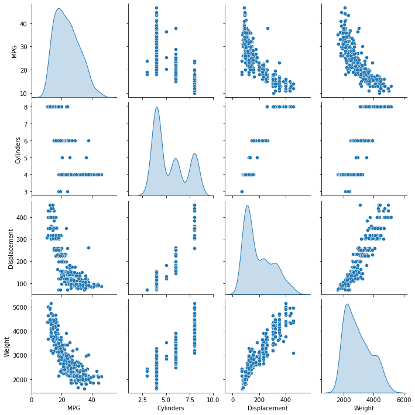
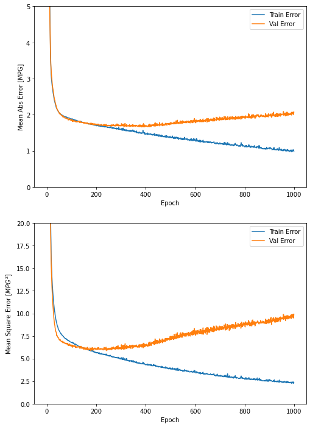
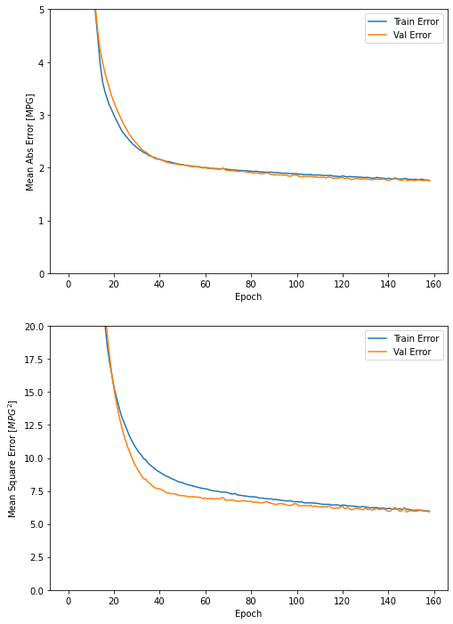
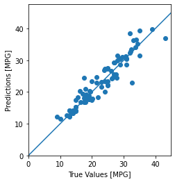
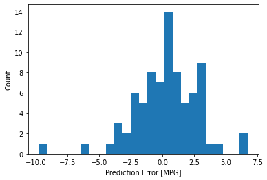

---

author: Hone Ye ji
categories: 
 - deep learning
 - code
tags: 
 - deep learning
 - 

toc: true
toc_label: "My Table of Contents"
toc_icon: "cog"
---

## 케라스(Keras) 코드
앞서 요약했던 DNN과 관련하여 모델을 만들고 예측하는 코드다. \\

데이터는 자동차 연비와 관련되어 있으며 이를 예측하는 모델과 실제값을 비교하는 내용이다.


```python
import pathlib

import matplotlib.pyplot as plt
import pandas as pd
import seaborn as sns

import tensorflow as tf
from tensorflow import keras
from tensorflow.keras import layers

print(tf.__version__)
```

    2.3.0
    

### 데이터셋
- 1970년대 후반과 1980년대 초반의 자동차 연비를 예측하는 모델
- 다운받고 열 지정


```python
dataset_path = keras.utils.get_file("auto-mpg.data", "http://archive.ics.uci.edu/ml/machine-learning-databases/auto-mpg/auto-mpg.data")
dataset_path
```


    'C:\\Users\\uos\\.keras\\datasets\\auto-mpg.data'


```python
column_names = ['MPG','Cylinders','Displacement','Horsepower','Weight',
                'Acceleration', 'Model Year', 'Origin']
raw_dataset = pd.read_csv(dataset_path, names=column_names,
                      na_values = "?", comment='\t',
                      sep=" ", skipinitialspace=True)

dataset = raw_dataset.copy()
dataset.tail()
```


<div>
<style scoped>
    .dataframe tbody tr th:only-of-type {
        vertical-align: middle;
    }

    .dataframe tbody tr th {
        vertical-align: top;
    }

    .dataframe thead th {
        text-align: right;
    }
</style>
<table border="1" class="dataframe">
  <thead>
    <tr style="text-align: right;">
      <th></th>
      <th>MPG</th>
      <th>Cylinders</th>
      <th>Displacement</th>
      <th>Horsepower</th>
      <th>Weight</th>
      <th>Acceleration</th>
      <th>Model Year</th>
      <th>Origin</th>
    </tr>
  </thead>
  <tbody>
    <tr>
      <th>393</th>
      <td>27.0</td>
      <td>4</td>
      <td>140.0</td>
      <td>86.0</td>
      <td>2790.0</td>
      <td>15.6</td>
      <td>82</td>
      <td>1</td>
    </tr>
    <tr>
      <th>394</th>
      <td>44.0</td>
      <td>4</td>
      <td>97.0</td>
      <td>52.0</td>
      <td>2130.0</td>
      <td>24.6</td>
      <td>82</td>
      <td>2</td>
    </tr>
    <tr>
      <th>395</th>
      <td>32.0</td>
      <td>4</td>
      <td>135.0</td>
      <td>84.0</td>
      <td>2295.0</td>
      <td>11.6</td>
      <td>82</td>
      <td>1</td>
    </tr>
    <tr>
      <th>396</th>
      <td>28.0</td>
      <td>4</td>
      <td>120.0</td>
      <td>79.0</td>
      <td>2625.0</td>
      <td>18.6</td>
      <td>82</td>
      <td>1</td>
    </tr>
    <tr>
      <th>397</th>
      <td>31.0</td>
      <td>4</td>
      <td>119.0</td>
      <td>82.0</td>
      <td>2720.0</td>
      <td>19.4</td>
      <td>82</td>
      <td>1</td>
    </tr>
  </tbody>
</table>
</div>


## 데이터 정제


```python
dataset.isna().sum()
```


    MPG             0
    Cylinders       0
    Displacement    0
    Horsepower      6
    Weight          0
    Acceleration    0
    Model Year      0
    Origin          0
    dtype: int64


```python
#결측치 데이터
dataset[dataset['Horsepower'].isnull()]

```


<div>
<style scoped>
    .dataframe tbody tr th:only-of-type {
        vertical-align: middle;
    }

    .dataframe tbody tr th {
        vertical-align: top;
    }

    .dataframe thead th {
        text-align: right;
    }
</style>
<table border="1" class="dataframe">
  <thead>
    <tr style="text-align: right;">
      <th></th>
      <th>MPG</th>
      <th>Cylinders</th>
      <th>Displacement</th>
      <th>Horsepower</th>
      <th>Weight</th>
      <th>Acceleration</th>
      <th>Model Year</th>
      <th>Origin</th>
    </tr>
  </thead>
  <tbody>
    <tr>
      <th>32</th>
      <td>25.0</td>
      <td>4</td>
      <td>98.0</td>
      <td>NaN</td>
      <td>2046.0</td>
      <td>19.0</td>
      <td>71</td>
      <td>1</td>
    </tr>
    <tr>
      <th>126</th>
      <td>21.0</td>
      <td>6</td>
      <td>200.0</td>
      <td>NaN</td>
      <td>2875.0</td>
      <td>17.0</td>
      <td>74</td>
      <td>1</td>
    </tr>
    <tr>
      <th>330</th>
      <td>40.9</td>
      <td>4</td>
      <td>85.0</td>
      <td>NaN</td>
      <td>1835.0</td>
      <td>17.3</td>
      <td>80</td>
      <td>2</td>
    </tr>
    <tr>
      <th>336</th>
      <td>23.6</td>
      <td>4</td>
      <td>140.0</td>
      <td>NaN</td>
      <td>2905.0</td>
      <td>14.3</td>
      <td>80</td>
      <td>1</td>
    </tr>
    <tr>
      <th>354</th>
      <td>34.5</td>
      <td>4</td>
      <td>100.0</td>
      <td>NaN</td>
      <td>2320.0</td>
      <td>15.8</td>
      <td>81</td>
      <td>2</td>
    </tr>
    <tr>
      <th>374</th>
      <td>23.0</td>
      <td>4</td>
      <td>151.0</td>
      <td>NaN</td>
      <td>3035.0</td>
      <td>20.5</td>
      <td>82</td>
      <td>1</td>
    </tr>
  </tbody>
</table>
</div>


```python
#결측치 평균으로 대체
dataset=dataset.fillna(dataset['Horsepower'].mean())
dataset[330:337]
```


<div>
<style scoped>
    .dataframe tbody tr th:only-of-type {
        vertical-align: middle;
    }

    .dataframe tbody tr th {
        vertical-align: top;
    }

    .dataframe thead th {
        text-align: right;
    }
</style>
<table border="1" class="dataframe">
  <thead>
    <tr style="text-align: right;">
      <th></th>
      <th>MPG</th>
      <th>Cylinders</th>
      <th>Displacement</th>
      <th>Horsepower</th>
      <th>Weight</th>
      <th>Acceleration</th>
      <th>Model Year</th>
      <th>Origin</th>
    </tr>
  </thead>
  <tbody>
    <tr>
      <th>330</th>
      <td>40.9</td>
      <td>4</td>
      <td>85.0</td>
      <td>104.469388</td>
      <td>1835.0</td>
      <td>17.3</td>
      <td>80</td>
      <td>2</td>
    </tr>
    <tr>
      <th>331</th>
      <td>33.8</td>
      <td>4</td>
      <td>97.0</td>
      <td>67.000000</td>
      <td>2145.0</td>
      <td>18.0</td>
      <td>80</td>
      <td>3</td>
    </tr>
    <tr>
      <th>332</th>
      <td>29.8</td>
      <td>4</td>
      <td>89.0</td>
      <td>62.000000</td>
      <td>1845.0</td>
      <td>15.3</td>
      <td>80</td>
      <td>2</td>
    </tr>
    <tr>
      <th>333</th>
      <td>32.7</td>
      <td>6</td>
      <td>168.0</td>
      <td>132.000000</td>
      <td>2910.0</td>
      <td>11.4</td>
      <td>80</td>
      <td>3</td>
    </tr>
    <tr>
      <th>334</th>
      <td>23.7</td>
      <td>3</td>
      <td>70.0</td>
      <td>100.000000</td>
      <td>2420.0</td>
      <td>12.5</td>
      <td>80</td>
      <td>3</td>
    </tr>
    <tr>
      <th>335</th>
      <td>35.0</td>
      <td>4</td>
      <td>122.0</td>
      <td>88.000000</td>
      <td>2500.0</td>
      <td>15.1</td>
      <td>80</td>
      <td>2</td>
    </tr>
    <tr>
      <th>336</th>
      <td>23.6</td>
      <td>4</td>
      <td>140.0</td>
      <td>104.469388</td>
      <td>2905.0</td>
      <td>14.3</td>
      <td>80</td>
      <td>1</td>
    </tr>
  </tbody>
</table>
</div>


## 원핫인코딩
- origin (1,2,3) : 범주형


```python
dataset.groupby('Origin').count()
```


<div>
<style scoped>
    .dataframe tbody tr th:only-of-type {
        vertical-align: middle;
    }

    .dataframe tbody tr th {
        vertical-align: top;
    }

    .dataframe thead th {
        text-align: right;
    }
</style>
<table border="1" class="dataframe">
  <thead>
    <tr style="text-align: right;">
      <th></th>
      <th>MPG</th>
      <th>Cylinders</th>
      <th>Displacement</th>
      <th>Horsepower</th>
      <th>Weight</th>
      <th>Acceleration</th>
      <th>Model Year</th>
    </tr>
    <tr>
      <th>Origin</th>
      <th></th>
      <th></th>
      <th></th>
      <th></th>
      <th></th>
      <th></th>
      <th></th>
    </tr>
  </thead>
  <tbody>
    <tr>
      <th>1</th>
      <td>249</td>
      <td>249</td>
      <td>249</td>
      <td>249</td>
      <td>249</td>
      <td>249</td>
      <td>249</td>
    </tr>
    <tr>
      <th>2</th>
      <td>70</td>
      <td>70</td>
      <td>70</td>
      <td>70</td>
      <td>70</td>
      <td>70</td>
      <td>70</td>
    </tr>
    <tr>
      <th>3</th>
      <td>79</td>
      <td>79</td>
      <td>79</td>
      <td>79</td>
      <td>79</td>
      <td>79</td>
      <td>79</td>
    </tr>
  </tbody>
</table>
</div>


```python
origin = dataset.pop('Origin')  # 레이블로 받음
```


```python
dataset['USA'] = (origin == 1)*1.0
dataset['Europe'] = (origin == 2)*1.0
dataset['Japan'] = (origin == 3)*1.0
dataset.tail()
```


<div>
<style scoped>
    .dataframe tbody tr th:only-of-type {
        vertical-align: middle;
    }

    .dataframe tbody tr th {
        vertical-align: top;
    }

    .dataframe thead th {
        text-align: right;
    }
</style>
<table border="1" class="dataframe">
  <thead>
    <tr style="text-align: right;">
      <th></th>
      <th>MPG</th>
      <th>Cylinders</th>
      <th>Displacement</th>
      <th>Horsepower</th>
      <th>Weight</th>
      <th>Acceleration</th>
      <th>Model Year</th>
      <th>USA</th>
      <th>Europe</th>
      <th>Japan</th>
    </tr>
  </thead>
  <tbody>
    <tr>
      <th>393</th>
      <td>27.0</td>
      <td>4</td>
      <td>140.0</td>
      <td>86.0</td>
      <td>2790.0</td>
      <td>15.6</td>
      <td>82</td>
      <td>1.0</td>
      <td>0.0</td>
      <td>0.0</td>
    </tr>
    <tr>
      <th>394</th>
      <td>44.0</td>
      <td>4</td>
      <td>97.0</td>
      <td>52.0</td>
      <td>2130.0</td>
      <td>24.6</td>
      <td>82</td>
      <td>0.0</td>
      <td>1.0</td>
      <td>0.0</td>
    </tr>
    <tr>
      <th>395</th>
      <td>32.0</td>
      <td>4</td>
      <td>135.0</td>
      <td>84.0</td>
      <td>2295.0</td>
      <td>11.6</td>
      <td>82</td>
      <td>1.0</td>
      <td>0.0</td>
      <td>0.0</td>
    </tr>
    <tr>
      <th>396</th>
      <td>28.0</td>
      <td>4</td>
      <td>120.0</td>
      <td>79.0</td>
      <td>2625.0</td>
      <td>18.6</td>
      <td>82</td>
      <td>1.0</td>
      <td>0.0</td>
      <td>0.0</td>
    </tr>
    <tr>
      <th>397</th>
      <td>31.0</td>
      <td>4</td>
      <td>119.0</td>
      <td>82.0</td>
      <td>2720.0</td>
      <td>19.4</td>
      <td>82</td>
      <td>1.0</td>
      <td>0.0</td>
      <td>0.0</td>
    </tr>
  </tbody>
</table>
</div>


## 데이터 셋 분할


```python
train_dataset = dataset.sample(frac=0.8,random_state=0)
test_dataset = dataset.drop(train_dataset.index)
```

## 시각화


```python
sns.pairplot(train_dataset[["MPG", "Cylinders", "Displacement", "Weight"]], diag_kind="kde")
```


    <seaborn.axisgrid.PairGrid at 0x18a81e1a490>


    

    


```python
train_stats = train_dataset.describe()
train_stats
```


<div>
<style scoped>
    .dataframe tbody tr th:only-of-type {
        vertical-align: middle;
    }

    .dataframe tbody tr th {
        vertical-align: top;
    }

    .dataframe thead th {
        text-align: right;
    }
</style>
<table border="1" class="dataframe">
  <thead>
    <tr style="text-align: right;">
      <th></th>
      <th>MPG</th>
      <th>Cylinders</th>
      <th>Displacement</th>
      <th>Horsepower</th>
      <th>Weight</th>
      <th>Acceleration</th>
      <th>Model Year</th>
      <th>USA</th>
      <th>Europe</th>
      <th>Japan</th>
    </tr>
  </thead>
  <tbody>
    <tr>
      <th>count</th>
      <td>318.000000</td>
      <td>318.000000</td>
      <td>318.000000</td>
      <td>318.000000</td>
      <td>318.000000</td>
      <td>318.000000</td>
      <td>318.000000</td>
      <td>318.000000</td>
      <td>318.000000</td>
      <td>318.000000</td>
    </tr>
    <tr>
      <th>mean</th>
      <td>23.590566</td>
      <td>5.427673</td>
      <td>193.061321</td>
      <td>104.073418</td>
      <td>2963.823899</td>
      <td>15.595912</td>
      <td>75.946541</td>
      <td>0.641509</td>
      <td>0.163522</td>
      <td>0.194969</td>
    </tr>
    <tr>
      <th>std</th>
      <td>7.913617</td>
      <td>1.682941</td>
      <td>103.812742</td>
      <td>38.368477</td>
      <td>844.749805</td>
      <td>2.796282</td>
      <td>3.705266</td>
      <td>0.480313</td>
      <td>0.370424</td>
      <td>0.396801</td>
    </tr>
    <tr>
      <th>min</th>
      <td>10.000000</td>
      <td>3.000000</td>
      <td>70.000000</td>
      <td>46.000000</td>
      <td>1613.000000</td>
      <td>8.000000</td>
      <td>70.000000</td>
      <td>0.000000</td>
      <td>0.000000</td>
      <td>0.000000</td>
    </tr>
    <tr>
      <th>25%</th>
      <td>17.125000</td>
      <td>4.000000</td>
      <td>100.250000</td>
      <td>75.250000</td>
      <td>2219.250000</td>
      <td>13.900000</td>
      <td>73.000000</td>
      <td>0.000000</td>
      <td>0.000000</td>
      <td>0.000000</td>
    </tr>
    <tr>
      <th>50%</th>
      <td>22.750000</td>
      <td>4.000000</td>
      <td>151.000000</td>
      <td>92.000000</td>
      <td>2792.500000</td>
      <td>15.500000</td>
      <td>76.000000</td>
      <td>1.000000</td>
      <td>0.000000</td>
      <td>0.000000</td>
    </tr>
    <tr>
      <th>75%</th>
      <td>29.000000</td>
      <td>6.000000</td>
      <td>259.500000</td>
      <td>120.000000</td>
      <td>3571.250000</td>
      <td>17.300000</td>
      <td>79.000000</td>
      <td>1.000000</td>
      <td>0.000000</td>
      <td>0.000000</td>
    </tr>
    <tr>
      <th>max</th>
      <td>46.600000</td>
      <td>8.000000</td>
      <td>455.000000</td>
      <td>230.000000</td>
      <td>5140.000000</td>
      <td>24.800000</td>
      <td>82.000000</td>
      <td>1.000000</td>
      <td>1.000000</td>
      <td>1.000000</td>
    </tr>
  </tbody>
</table>
</div>


```python
train_stats.pop("MPG")  # mpg(자동차 연비: y)
train_stats = train_stats.transpose()
train_stats  # 값의 범위가 크기때문에 정규화 진행 필요
```


<div>
<style scoped>
    .dataframe tbody tr th:only-of-type {
        vertical-align: middle;
    }

    .dataframe tbody tr th {
        vertical-align: top;
    }

    .dataframe thead th {
        text-align: right;
    }
</style>
<table border="1" class="dataframe">
  <thead>
    <tr style="text-align: right;">
      <th></th>
      <th>count</th>
      <th>mean</th>
      <th>std</th>
      <th>min</th>
      <th>25%</th>
      <th>50%</th>
      <th>75%</th>
      <th>max</th>
    </tr>
  </thead>
  <tbody>
    <tr>
      <th>Cylinders</th>
      <td>318.0</td>
      <td>5.427673</td>
      <td>1.682941</td>
      <td>3.0</td>
      <td>4.00</td>
      <td>4.0</td>
      <td>6.00</td>
      <td>8.0</td>
    </tr>
    <tr>
      <th>Displacement</th>
      <td>318.0</td>
      <td>193.061321</td>
      <td>103.812742</td>
      <td>70.0</td>
      <td>100.25</td>
      <td>151.0</td>
      <td>259.50</td>
      <td>455.0</td>
    </tr>
    <tr>
      <th>Horsepower</th>
      <td>318.0</td>
      <td>104.073418</td>
      <td>38.368477</td>
      <td>46.0</td>
      <td>75.25</td>
      <td>92.0</td>
      <td>120.00</td>
      <td>230.0</td>
    </tr>
    <tr>
      <th>Weight</th>
      <td>318.0</td>
      <td>2963.823899</td>
      <td>844.749805</td>
      <td>1613.0</td>
      <td>2219.25</td>
      <td>2792.5</td>
      <td>3571.25</td>
      <td>5140.0</td>
    </tr>
    <tr>
      <th>Acceleration</th>
      <td>318.0</td>
      <td>15.595912</td>
      <td>2.796282</td>
      <td>8.0</td>
      <td>13.90</td>
      <td>15.5</td>
      <td>17.30</td>
      <td>24.8</td>
    </tr>
    <tr>
      <th>Model Year</th>
      <td>318.0</td>
      <td>75.946541</td>
      <td>3.705266</td>
      <td>70.0</td>
      <td>73.00</td>
      <td>76.0</td>
      <td>79.00</td>
      <td>82.0</td>
    </tr>
    <tr>
      <th>USA</th>
      <td>318.0</td>
      <td>0.641509</td>
      <td>0.480313</td>
      <td>0.0</td>
      <td>0.00</td>
      <td>1.0</td>
      <td>1.00</td>
      <td>1.0</td>
    </tr>
    <tr>
      <th>Europe</th>
      <td>318.0</td>
      <td>0.163522</td>
      <td>0.370424</td>
      <td>0.0</td>
      <td>0.00</td>
      <td>0.0</td>
      <td>0.00</td>
      <td>1.0</td>
    </tr>
    <tr>
      <th>Japan</th>
      <td>318.0</td>
      <td>0.194969</td>
      <td>0.396801</td>
      <td>0.0</td>
      <td>0.00</td>
      <td>0.0</td>
      <td>0.00</td>
      <td>1.0</td>
    </tr>
  </tbody>
</table>
</div>


## 특성과 레이블 분리


```python
train_labels = train_dataset.pop('MPG')
test_labels = test_dataset.pop('MPG')
```

## 정규화


```python
def norm(x):
  return (x - train_stats['mean']) / train_stats['std']
normed_train_data = norm(train_dataset)
normed_test_data = norm(test_dataset)
```

## 모델 만들기
- densely connected 2개의 층


```python
def build_model():
    model =keras.Sequential([
        layers.Dense(64,activation='relu',input_shape=[len(train_dataset.keys())]),
        layers.Dense(64, activation='relu'),
        layers.Dense(1)
    ])

    optimizer=tf.keras.optimizers.Adam(0.001) 
    
    model.compile(loss='mse', optimizer=optimizer,metrics=['mae','mse']) # 분류일때,'accuracy'
    
    return model
```


```python
model=build_model()
```


```python
model.summary()
```

    Model: "sequential_2"
    _________________________________________________________________
    Layer (type)                 Output Shape              Param #   
    =================================================================
    dense_6 (Dense)              (None, 64)                640       
    _________________________________________________________________
    dense_7 (Dense)              (None, 64)                4160      
    _________________________________________________________________
    dense_8 (Dense)              (None, 1)                 65        
    =================================================================
    Total params: 4,865
    Trainable params: 4,865
    Non-trainable params: 0
    _________________________________________________________________
    


```python
example_batch = normed_train_data[:10]
example_result = model.predict(example_batch)
example_result
```


    array([[ 0.0416676 ],
           [-0.03854847],
           [-0.11580162],
           [-0.17297746],
           [ 0.00868107],
           [-0.3099752 ],
           [-0.3315743 ],
           [ 0.02203141],
           [ 0.15218496],
           [ 0.0900453 ]], dtype=float32)


## 모델 훈련
- 1000번의 epoch동안 훈련


```python
# 에포크가 끝날 때마다 점(.)을 출력해 훈련 진행 과정을 표시합니다
class PrintDot(keras.callbacks.Callback):
  def on_epoch_end(self, epoch, logs):
    if epoch % 100 == 0: print('')
    print('.', end='')

EPOCHS = 1000

history = model.fit(
  normed_train_data, train_labels,
  epochs=EPOCHS, validation_split = 0.2, verbose=0,
  callbacks=[PrintDot()])
```

    
    ....................................................................................................
    ....................................................................................................
    ....................................................................................................
    ....................................................................................................
    ....................................................................................................
    ....................................................................................................
    ....................................................................................................
    ....................................................................................................
    ....................................................................................................
    ....................................................................................................


```python
hist = pd.DataFrame(history.history)
hist['epoch'] = history.epoch
hist.tail()
```


<div>
<style scoped>
    .dataframe tbody tr th:only-of-type {
        vertical-align: middle;
    }

    .dataframe tbody tr th {
        vertical-align: top;
    }

    .dataframe thead th {
        text-align: right;
    }
</style>
<table border="1" class="dataframe">
  <thead>
    <tr style="text-align: right;">
      <th></th>
      <th>loss</th>
      <th>mae</th>
      <th>mse</th>
      <th>val_loss</th>
      <th>val_mae</th>
      <th>val_mse</th>
      <th>epoch</th>
    </tr>
  </thead>
  <tbody>
    <tr>
      <th>995</th>
      <td>2.358095</td>
      <td>1.010328</td>
      <td>2.358095</td>
      <td>9.766920</td>
      <td>2.035713</td>
      <td>9.766920</td>
      <td>995</td>
    </tr>
    <tr>
      <th>996</th>
      <td>2.424612</td>
      <td>1.034429</td>
      <td>2.424612</td>
      <td>9.920653</td>
      <td>2.076196</td>
      <td>9.920653</td>
      <td>996</td>
    </tr>
    <tr>
      <th>997</th>
      <td>2.260907</td>
      <td>1.004899</td>
      <td>2.260907</td>
      <td>9.677170</td>
      <td>2.016382</td>
      <td>9.677170</td>
      <td>997</td>
    </tr>
    <tr>
      <th>998</th>
      <td>2.379298</td>
      <td>1.019345</td>
      <td>2.379298</td>
      <td>9.484661</td>
      <td>2.004562</td>
      <td>9.484661</td>
      <td>998</td>
    </tr>
    <tr>
      <th>999</th>
      <td>2.322387</td>
      <td>0.990800</td>
      <td>2.322387</td>
      <td>9.923290</td>
      <td>2.072285</td>
      <td>9.923290</td>
      <td>999</td>
    </tr>
  </tbody>
</table>
</div>


```python
import matplotlib.pyplot as plt

def plot_history(history):
  hist = pd.DataFrame(history.history)
  hist['epoch'] = history.epoch

  plt.figure(figsize=(8,12))

  plt.subplot(2,1,1)
  plt.xlabel('Epoch')
  plt.ylabel('Mean Abs Error [MPG]')
  plt.plot(hist['epoch'], hist['mae'],
           label='Train Error')
  plt.plot(hist['epoch'], hist['val_mae'],
           label = 'Val Error')
  plt.ylim([0,5])
  plt.legend()

  plt.subplot(2,1,2)
  plt.xlabel('Epoch')
  plt.ylabel('Mean Square Error [$MPG^2$]')
  plt.plot(hist['epoch'], hist['mse'],
           label='Train Error')
  plt.plot(hist['epoch'], hist['val_mse'],
           label = 'Val Error')
  plt.ylim([0,20])
  plt.legend()
  plt.show()

plot_history(history)
```


    

    


train과 val error의 차이가 많이 나서 지정된 에포크 횟수동안 성능향상이 없으면 자동으로 훈련을 멈춤


```python
model = build_model()

# patience 매개변수는 성능 향상을 체크할 에포크 횟수입니다
early_stop = keras.callbacks.EarlyStopping(monitor='val_loss', patience=10)

history = model.fit(normed_train_data, train_labels, epochs=EPOCHS,
                    validation_split = 0.2, verbose=0, callbacks=[early_stop, PrintDot()])

plot_history(history)
```

    
    ....................................................................................................
    ...........................................................


    

    


## 테스트세트로 평가


```python
loss, mae, mse = model.evaluate(normed_test_data, test_labels, verbose=2)

print("테스트 세트의 평균 절대 오차: {:5.2f} MPG".format(mae))
```

    3/3 - 0s - loss: 6.5907 - mae: 1.9264 - mse: 6.5907
    테스트 세트의 평균 절대 오차:  1.93 MPG
    

## 예측
- 테스트 세트(실제 y)에서 MPG값 예측 비교


```python
test_predictions = model.predict(normed_test_data).flatten()

plt.scatter(test_labels, test_predictions)
plt.xlabel('True Values [MPG]')
plt.ylabel('Predictions [MPG]')
plt.axis('equal')
plt.axis('square')
plt.xlim([0,plt.xlim()[1]])
plt.ylim([0,plt.ylim()[1]])
_ = plt.plot([-100, 100], [-100, 100])
```


    

    


```python
error = test_predictions - test_labels
plt.hist(error, bins = 25)
plt.xlabel("Prediction Error [MPG]")
_ = plt.ylabel("Count")
```


    

    

참고: TensorFlow 자동차 연비 예측하기 : 회귀

<!--stackedit_data:
eyJoaXN0b3J5IjpbLTUxOTg5OTkzMl19
-->
